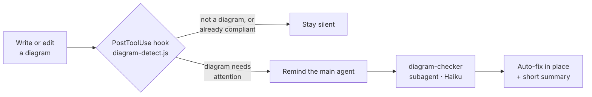

# Mermaid Diagram Gold-Standard Checker (Claude Code)

A **user-level** Claude Code add-on that holds every Mermaid diagram you create to one
professional standard — readable fonts and proper spacing, including the labels on the
connections between nodes — and **auto-fixes** any diagram that falls short. The checking
runs on the low-cost **Haiku** model, so it costs almost nothing.

Mermaid defaults to the Trebuchet MS font and cramped spacing. This add-on makes every
diagram render with a professional **Inter-led** font stack, roomier node/rank spacing,
and wrapped connection labels — without you having to remember to apply it, in any project.

## How it works



Three cooperating pieces:

| Component | File | Role |
|-----------|------|------|
| **Skill** | `.claude/skills/diagram-gold-standard/SKILL.md` | Always-loadable rubric — makes the main agent author diagrams gold-compliant from the start. |
| **Subagent** | `.claude/agents/diagram-checker.md` | The checker (`model: haiku`) — validates and auto-fixes a diagram, then prints a one-line summary. |
| **Hook** | `.claude/hooks/diagram-detect.js` | A `PostToolUse` hook (Node) that scans every file write for Mermaid syntax and nudges the agent to run the checker. Silent for non-diagrams or already-compliant diagrams. |

Because Claude Code session hooks **do not fire for a subagent's own tool calls**, the
checker's fixes cannot re-trigger the hook — so there is no loop. The hook is also
**idempotent**: a diagram that already carries the gold font signature is left alone, and
it **fails open** (any error → no output, never blocks your work).

## The gold standard

Every Mermaid diagram starts with this init directive as its **first line, on a single
physical line** (multi-line `%%{init}%%` breaks rendering on GitHub/Notion):

```
%%{init: {"fontFamily": "Inter, Segoe UI, Roboto, Helvetica Neue, system-ui, sans-serif", "fontSize": 16, "flowchart": {"nodeSpacing": 60, "rankSpacing": 70, "wrappingWidth": 220, "curve": "basis"}, "sequence": {"messageMargin": 40, "boxMargin": 12, "boxTextMargin": 6, "noteMargin": 12, "wrap": true}}}%%
```

| Rule | Standard |
|------|----------|
| Font | `Inter, Segoe UI, Roboto, Helvetica Neue, system-ui, sans-serif`, `fontSize` 16 (min 14) |
| Flowchart spacing | `nodeSpacing` 60, `rankSpacing` 70, `wrappingWidth` 220, `curve` `basis` |
| Sequence spacing | `messageMargin` 40, `boxMargin` 12, `boxTextMargin` 6, `noteMargin` 12, `wrap` true |
| Connection labels | wrap any edge label longer than ~22 chars with `<br/>` so it doesn't overlap edges/nodes |
| Direction | prefer `TD`/`TB` or `LR` |

Scope is deliberately limited to **fonts, spacing, and label wrapping** — colours, themes,
node text, and diagram logic are never changed.

## Install (user-level, works in every project)

1. Copy the contents of this repo's `.claude/` into your home Claude config (`~/.claude/`):
   - `agents/diagram-checker.md`
   - `skills/diagram-gold-standard/SKILL.md`
   - `hooks/diagram-detect.js`

2. Add the `PostToolUse` hook to `~/.claude/settings.json` (merge into your existing `hooks`):

   ```json
   {
     "hooks": {
       "PostToolUse": [
         {
           "matcher": "Write|Edit|MultiEdit",
           "hooks": [
             { "type": "command", "command": "node \"$HOME/.claude/hooks/diagram-detect.js\"" }
           ]
         }
       ]
     }
   }
   ```

   On Windows, use the absolute path instead of `$HOME`, e.g.
   `node "C:\\Users\\<you>\\.claude\\hooks\\diagram-detect.js"`.

3. (Optional) Add a pointer to `~/.claude/CLAUDE.md` so the standard is in context every session:

   > **Diagrams:** Always follow the `diagram-gold-standard` skill when creating/editing Mermaid diagrams; the `diagram-checker` (Haiku) auto-validates them.

4. **Restart Claude Code once.** Hooks and skills reload live, but the subagent registry is
   read at session start — so `diagram-checker` becomes invocable after a restart.

## Requirements

- Claude Code with `node` on `PATH` (bundled with Claude Code).
- The `diagram-checker` subagent uses `model: haiku`.

## Repo layout

```
.claude/
  agents/diagram-checker.md                 # the Haiku checker
  skills/diagram-gold-standard/SKILL.md      # always-loadable rubric
  hooks/diagram-detect.js                    # PostToolUse detector (Node)
README.md
```
